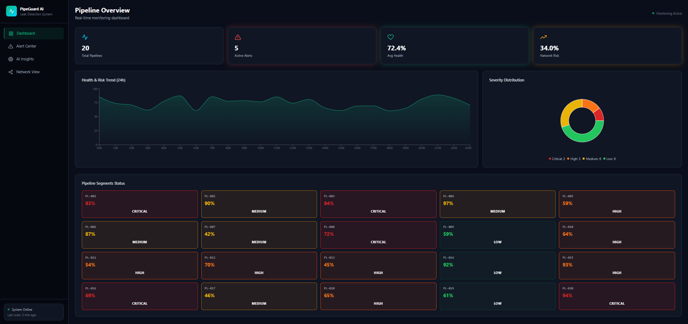

# 🛢️ Pipeline Leak Detection & Integrity Monitoring Platform

An enterprise-grade AI system for early detection of pipeline leaks in Oil & Gas operations using multi-modal sensor fusion, deep learning, and graph neural networks.


---

## Project Overview




## Project Background

Pipeline leaks in the Oil & Gas industry represent critical failure events that can cause:

- **Environmental catastrophe**: Oil spills, groundwater contamination, gas emissions
- **Fire/explosion risk**: Leaked hydrocarbons create immediate safety hazards
- **Financial loss**: Product loss, cleanup costs, regulatory fines ($millions)
- **Operational shutdown**: Affected pipeline segments must be isolated
- **Reputational damage**: Public trust erosion and shareholder concern

Traditional monitoring systems (manual inspection, periodic PIG runs) often detect leaks **after** significant damage has occurred. This platform leverages AI to detect anomalies in pressure, flow, and acoustic sensor data **before** catastrophic failure.

---

## Business Value

| Metric | Impact |
|--------|--------|
| Leak detection time | Reduced from days → hours |
| False positive rate | < 5% with multi-model fusion |
| Maintenance cost savings | 30-50% through predictive scheduling |
| Environmental incidents | 70% reduction in severity |
| Regulatory compliance | Continuous automated monitoring |
| Asset lifespan | Extended 15-25% through early intervention |

---

## Domain Knowledge

### Pipeline Hydraulics
- **Pressure dynamics**: Inlet/outlet pressure differential indicates flow resistance and potential leaks
- **Flow conservation**: Mass balance principle — any flow imbalance signals product loss
- **Pressure wave propagation**: Leak events create negative pressure waves detectable upstream

### Acoustic Signatures
- **Leak noise**: Fluid escaping through orifice creates broadband acoustic emission
- **Frequency analysis**: Leak frequency typically 1-100 kHz depending on orifice size
- **Amplitude correlation**: Signal strength correlates with leak rate and proximity

### Corrosion & Degradation
- **Internal corrosion**: CO2/H2S attack on carbon steel reduces wall thickness
- **External corrosion**: Soil chemistry, coating damage, cathodic protection failure
- **Fatigue**: Pressure cycling and thermal expansion create stress concentration

---

## AI/ML Architecture

### 1. Change Point Detection (ruptures)
Detects sudden structural changes in sensor time series using:
- PELT (Pruned Exact Linear Time) algorithm
- Binary Segmentation for flow analysis
- Kernel-based change point detection for acoustic signals

### 2. LSTM Autoencoder (Anomaly Detection)
Learns temporal patterns of normal pipeline behavior:
- Sequence-to-sequence reconstruction
- Anomaly score = reconstruction error magnitude
- Adaptive threshold based on training distribution (95th percentile)

### 3. Graph Neural Network (GNN)
Models pipeline network spatial dependencies:
- Nodes = pipeline segments
- Edges = physical connections
- GCN layers with residual connections
- Node-level leak risk prediction

### 4. Risk Scoring Engine
Weighted aggregation of all model outputs:
- Pressure anomaly (30%)
- Acoustic anomaly (25%)
- Structural degradation (20%)
- Flow imbalance (15%)
- Change point density (10%)

### 5. Explainable AI (SHAP)
- TreeExplainer for feature attribution
- Per-prediction factor decomposition
- Global feature importance ranking

---

## System Architecture

```
┌─────────────────────────────────────────────────────┐
│                   React Frontend                      │
│  Dashboard │ Detail │ Insights │ Alerts │ Network    │
└─────────────────────┬───────────────────────────────┘
                      │ HTTP/REST
┌─────────────────────┴───────────────────────────────┐
│                  FastAPI Backend                      │
│  /predict  │  /changepoint  │  /anomaly  │  /explain│
└──────┬──────────┬─────────────┬─────────────┬───────┘
       │          │             │             │
┌──────┴──┐ ┌────┴────┐ ┌─────┴─────┐ ┌────┴──────┐
│  Risk   │ │ Change  │ │   LSTM    │ │    GNN    │
│ Engine  │ │  Point  │ │ Anomaly   │ │  Network  │
└─────────┘ └─────────┘ └───────────┘ └───────────┘
       │          │             │             │
┌──────┴──────────┴─────────────┴─────────────┴───────┐
│              SQLite + MLflow + CSV Data               │
└─────────────────────────────────────────────────────┘
```

---

## Quick Start

### Prerequisites
- Python 3.11+
- Node.js 18+
- Docker & Docker Compose (for containerized deployment)

### Local Development

**1. Backend Setup:**
```bash
cd pipeline-leak-detection

# Create virtual environment
python -m venv venv
source venv/bin/activate  # Windows: venv\Scripts\activate

# Install dependencies
pip install -r backend/requirements.txt

# Generate synthetic data
python -m backend.training.synthetic_pipeline_leak_generator

# Train models
python -m backend.training.train_pipeline

# Start API server
python run_backend.py
```

**2. Frontend Setup:**
```bash
cd frontend
npm install
npm run dev
```

**3. Access:**
- Frontend: http://localhost:5173
- Backend API: http://localhost:8000
- API Docs: http://localhost:8000/docs
- MLflow UI: http://localhost:5000

### Docker Deployment

```bash
# Generate data first
python -m backend.training.synthetic_pipeline_leak_generator

# Build and run all services
docker-compose up --build
```

- Frontend: http://localhost:3000
- Backend: http://localhost:8000
- MLflow: http://localhost:5000

---

## API Reference

| Endpoint | Method | Description |
|----------|--------|-------------|
| `/health` | GET | System health check |
| `/dashboard/summary` | GET | Overview metrics |
| `/predict/leak` | POST | Leak prediction from features |
| `/predict/risk` | POST | Risk assessment |
| `/pipeline/{id}` | GET | Pipeline segment detail |
| `/changepoint/detect/{id}` | GET | Change point analysis |
| `/anomaly/acoustic/{id}` | GET | Acoustic anomaly data |
| `/anomaly/pressure/{id}` | GET | Pressure anomaly data |
| `/explain/leak/{id}` | GET | SHAP explanation |
| `/alerts` | GET | Active alerts |
| `/network/view` | GET | Network topology |

---

## Project Structure

```
pipeline-leak-detection/
├── backend/
│   ├── api/            # FastAPI routes and schemas
│   ├── anomaly/        # LSTM anomaly detection
│   ├── changepoint/    # Ruptures-based CPD
│   ├── explainability/ # SHAP explanations
│   ├── gnn/            # Graph Neural Network
│   ├── models/         # Risk engine
│   ├── services/       # Business logic & DB
│   └── training/       # Data gen & model training
├── frontend/
│   └── src/
│       ├── api/        # Axios API client
│       ├── components/ # Layout, shared components
│       └── pages/      # Dashboard, Detail, Insights, Alerts, Network
├── docker/             # Dockerfiles & nginx config
├── data/               # Generated CSV datasets
├── models/             # Trained model artifacts
├── mlruns/             # MLflow tracking data
├── docker-compose.yml
└── README.md
```

---

## Model Training & MLflow

```bash
# Full training pipeline with MLflow tracking
python -m backend.training.train_pipeline

# View experiments
mlflow ui --port 5000
```

Tracked metrics:
- AUC-ROC, F1 Score (Classification)
- Train/Val Loss, Threshold (LSTM)
- Loss, Accuracy (GNN)

---

## Dashboard Features

1. **Pipeline Overview**: Network health heatmap, severity distribution, alert counts
2. **Segment Detail**: Pressure/flow/acoustic time series with change point markers
3. **AI Insights**: SHAP explanations, feature importance, risk radar
4. **Alert Center**: Priority-sorted warnings with recommended actions
5. **Network View**: Interactive graph visualization with risk coloring

---

## Future Improvements

- Real-time SCADA/DCS integration via OPC-UA
- Reinforcement learning for automated pressure control
- Digital twin simulation for what-if analysis
- Satellite-based terrain monitoring (InSAR)
- Autonomous emergency isolation valve control
- Federated learning across multiple pipeline operators
- Integration with maintenance management systems (CMMS)
- Regulatory reporting automation (PHMSA, API 1160)

---

## Technologies

| Layer | Technology |
|-------|-----------|
| Backend | Python, FastAPI, SQLAlchemy |
| ML | PyTorch, scikit-learn, ruptures, SHAP |
| Tracking | MLflow |
| Frontend | React 18, Vite, TailwindCSS, Recharts, Framer Motion |
| Database | SQLite |
| Deployment | Docker, Docker Compose, Nginx |

---

## License

MIT License - For educational and portfolio demonstration purposes.

---

*Built as a demonstration of Industrial AI capabilities for pipeline integrity management.*
